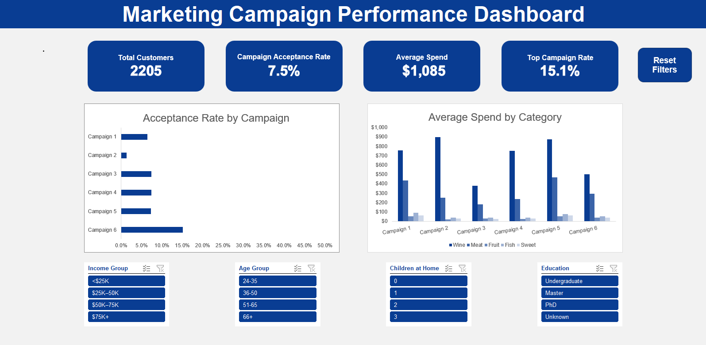

# iFood Marketing Campaign Analysis
**Excel-based customer segmentation and campaign performance study**

---

## Project Overview

This project analyzes marketing campaign performance across a dataset of 2,205 iFood customers. The goal was to identify which customer segments respond best to campaigns, what drives total spend, and how future campaigns should be targeted for maximum impact.

**Tools used:** Microsoft Excel (PivotTables, Power Pivot, Power Query, DAX, VBA, Slicers, Charts, Conditional Formatting)

---

## The Business Questions

- Which of the 6 campaigns performed best, and why?
- What customer profile is most likely to accept a campaign?
- What drives total customer spend?
- How should future campaigns be targeted?

---

## Dashboard

The interactive dashboard includes:

| Component | Description |
|---|---|
| **KPI 1** | Total Customers |
| **KPI 2** | Campaign Acceptance Rate |
| **KPI 3** | Average Spend |
| **KPI 4** | Top Campaign Rate |
| **Chart 1** | Acceptance Rate by Campaign |
| **Chart 2** | Average Spend by Category |
| **Slicers** | Filter by Income Group, Age Group, Children at Home, Education |

---

## Workbook Structure

| Sheet | Purpose |
|---|---|
| `Main` | Cleaned dataset — 2,205 rows, 38 columns including demographics, spend by category, channel usage, and campaign responses |
| `Accepted Customer Profile` | PivotTable summarizing spend profile and acceptance rates for customers who accepted each campaign |
| `Calculations` | Named cells powering KPI cards on the dashboard |
| `Dashboard` | Interactive visual layer with charts, KPIs, and slicers |

---

## Key Findings

**1. Children in the home is the strongest spend predictor**
Customers with no children spend an average of $841 vs. $183 for those with one child — a 4.6x difference that outweighs income group as a segmentation signal.

**2. Campaign 6 was the clear winner**
Campaign 6 achieved a 15.1% acceptance rate, more than double any other campaign. Its acceptors skewed child-free, high-income, and wine-heavy in their spending.

**3. High-value customers are concentrated**
The $75K+ income group (16% of customers) drives average spend of $1,372 — 26x the sub-$25K cohort. Campaign 5 reached this group at a 38% acceptance rate, the highest of any income/campaign combination.

**4. Campaign 2 significantly underperformed**
At 1.4% acceptance (30 customers), Campaign 2 was nearly an order of magnitude less effective than Campaign 6. Its offer structure or targeting logic should be revisited.

**5. Wine and meat dominate the product mix**
These two categories represent 83.8% of all customer spend. Campaign design should lead with wine and premium meat offers.

**6. Campaign acceptors are higher-value customers**
Customers who accepted any campaign spent $937 on average vs. $422 for non-acceptors — a 2.2x gap — and made purchases more recently (44 vs. 51 days).

---

## Data & Methodology

**Dataset:** 2,205 customer records with the following variable groups:
- **Demographics:** Age, income, marital status, education, household composition
- **Spend:** Total spend + breakdown across 6 product categories (wines, fruits, meat, fish, sweets, gold)
- **Channels:** Web, catalog, and in-store purchase counts; web visits per month
- **Campaigns:** Binary acceptance flags for Campaigns 1–6
- **Engagement:** Days since last purchase (recency), days as a customer, complaint flag

**Excel techniques applied:**
- PivotTables with calculated fields for acceptance rates and spend averages
- Dynamic KPI cards using named ranges and AVERAGEIF / COUNTIF logic
- Slicers connected to multiple PivotTables for cross-filtering
- Conditional formatting to highlight performance outliers
- One-hot encoded categorical variables decoded for segment-level analysis

---

## How to Use

1. Download `iFood_campaign_analysis.xlsm`
2. Enable macros if prompted
3. Navigate to the **Dashboard** tab
4. Use the slicers to filter by Income Group, Age Group, Children at Home, or Education
5. Charts and KPIs update dynamically based on slicer selection

---

## Business Recommendations

| Priority | Recommendation |
|---|---|
| 🎯 Target | Child-free households + $75K+ income for premium campaigns |
| 📦 Lead with | Wine and meat — 84% of wallet share |
| 📈 Scale | Campaign 6's structure for volume; Campaign 5's for LTV |
| ❌ Retire | Campaign 2's approach — 1.4% acceptance is not scalable |
| 👴 Don't ignore | 66+ age group — highest spend ($701 avg) and acceptance rate (30%) |

---

## About

This case study was completed as part of a self-directed data analytics portfolio.
Feel free to connect on [LinkedIn](https://linkedin.com/in/aristotlepolites/) if you have questions or feedback.
